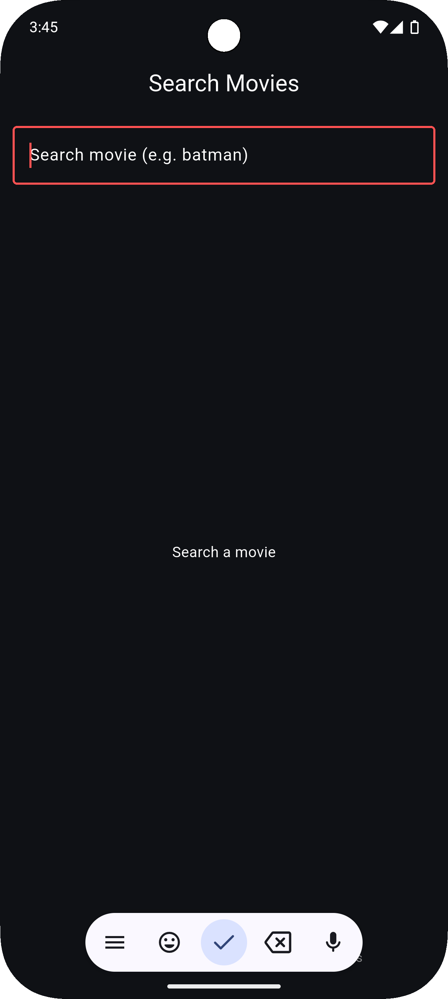
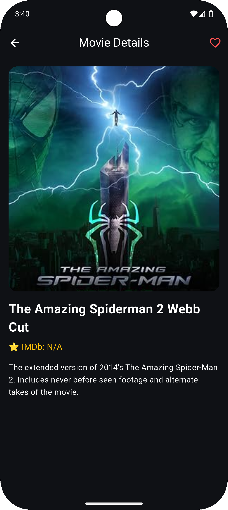
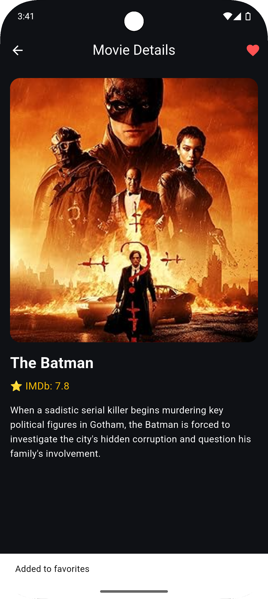
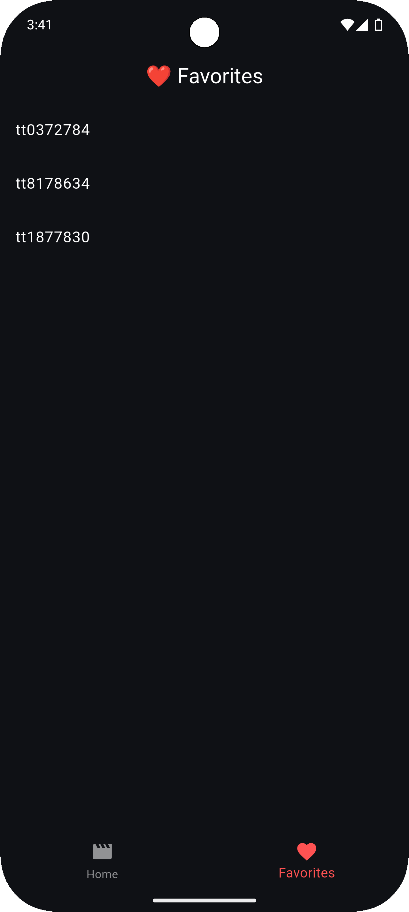

# 🎬 OMDb Movie App (Flutter)

A modern Flutter movie search application that fetches real-time movie data using the **OMDb API**.
This project demonstrates REST API integration, JSON parsing, shimmer loading, favorites feature, and a Netflix-style dark UI.

---
## 📸 Screenshots

### 🖼️ Screen 1


### 🖼️ Screen 2


### 🖼️ Screen 3


### 🖼️ Screen 4


---

## 🚀 Features

* 🔍 Search movies in real time
* 🎬 Movie details screen
* ❤️ Add/Remove favorites (local storage)
* ✨ Shimmer loading effect
* 📱 Bottom navigation
* 🎨 Premium dark Netflix-style UI
* ⚡ Fast API-based data fetching

---

## 🔗 API Used

**OMDb API**
Base URL:

```
https://www.omdbapi.com/
```

### Example Search Request

```
https://www.omdbapi.com/?apikey=YOUR_API_KEY&s=batman
```

### Example Details Request

```
https://www.omdbapi.com/?apikey=YOUR_API_KEY&i=tt0372784
```

---

## 🧠 JSON Parsing Explanation

The app fetches movie data from OMDb in JSON format and converts it into Dart objects.

### Sample JSON Response

```json
{
  "Title": "Batman Begins",
  "Year": "2005",
  "imdbID": "tt0372784",
  "Type": "movie",
  "Poster": "https://..."
}
```

### Parsing Steps

1. HTTP request sent using the **http** package
2. Response decoded using `jsonDecode()`
3. Data mapped to Dart model using `Movie.fromJson()`
4. UI updated using `FutureBuilder`

This ensures type safety and clean architecture.

---

## 🛠️ Tech Stack

* Flutter
* Dart
* OMDb REST API
* SharedPreferences
* Shimmer

---

## ▶️ How to Run the Project

1. Clone the repository
2. Run:

```
flutter pub get
```

3. Add your OMDb API key in:

```
lib/utils/constants.dart
```

4. Run the app:

```
flutter run
```

---

## 📁 Project Structure

```
lib/
 ┣ models/
 ┣ screens/
 ┣ services/
 ┣ widgets/
 ┣ utils/
 ┗ theme/
```

---

## 👨‍💻 Author

**Mohd Danish**

---

⭐ If you like this project, consider giving it a star on GitHub!
